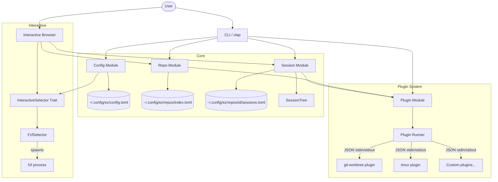
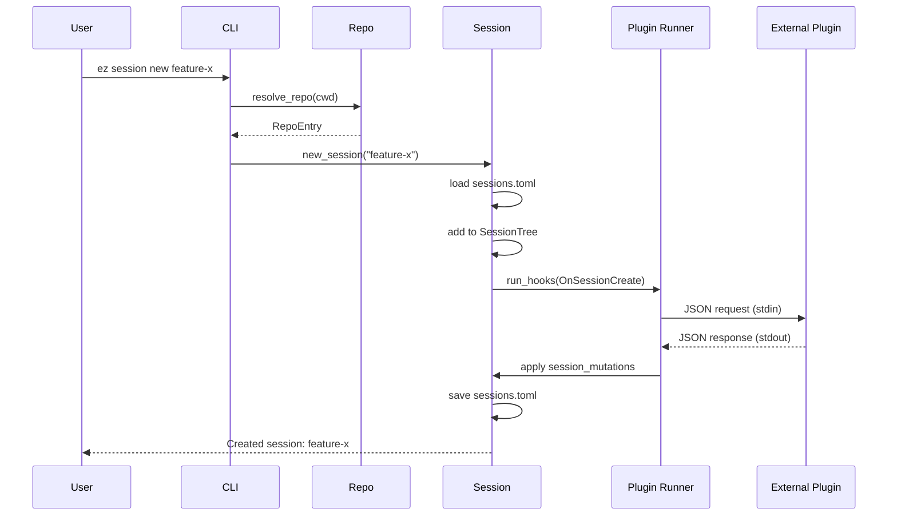
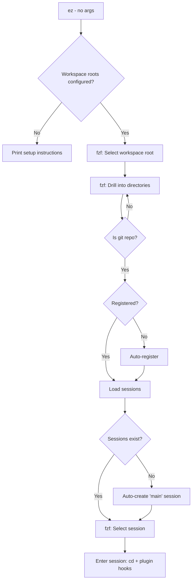
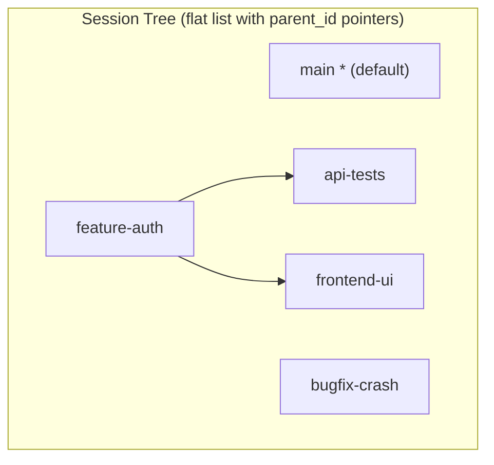
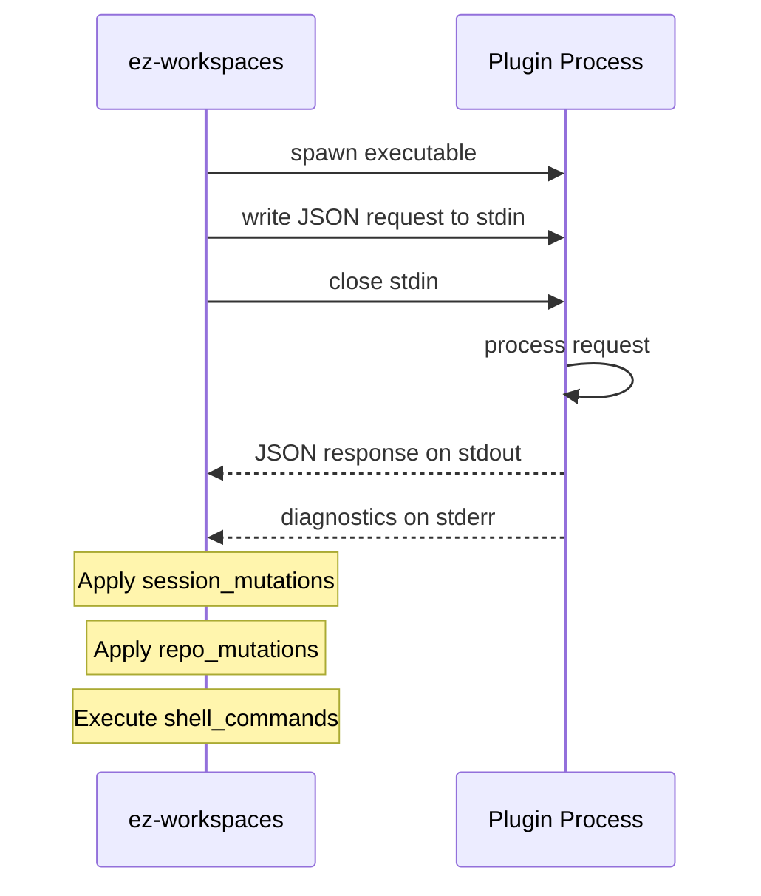
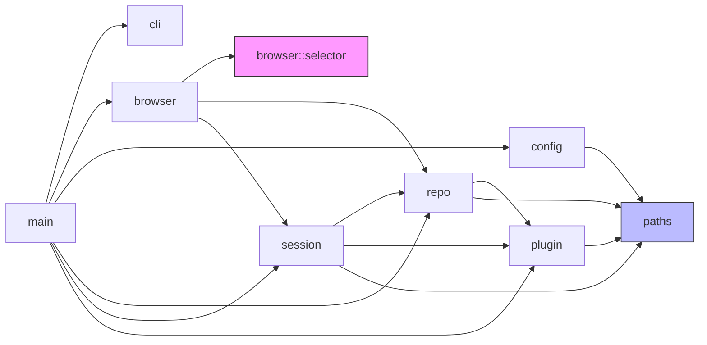
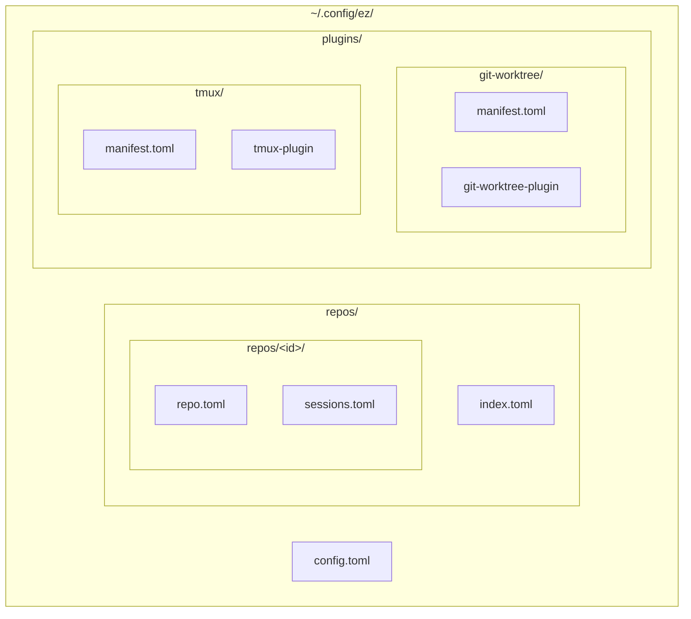

# Design

## High-Level Architecture

```mermaid
graph TB
    User([User]) --> CLI[CLI / clap]
    User --> Browser[Interactive Browser]

    CLI --> Config[Config Module]
    CLI --> Repo[Repo Module]
    CLI --> Session[Session Module]
    CLI --> Plugin[Plugin Module]
    Browser --> Selector[InteractiveSelector Trait]

    subgraph Core
        Config --> ConfigStore[(~/.config/ez/config.toml)]
        Repo --> RepoStore[(~/.config/ez/repos/index.toml)]
        Session --> SessionStore[(~/.config/ez/repos/id/sessions.toml)]
        Session --> Tree[SessionTree]
    end

    subgraph Plugin System
        Plugin --> Runner[Plugin Runner]
        Runner --> |JSON stdin/stdout| GitWorktree[git-worktree plugin]
        Runner --> |JSON stdin/stdout| Tmux[tmux plugin]
        Runner --> |JSON stdin/stdout| Custom[Custom plugins...]
    end

    subgraph Interactive
        Selector --> FzfSelector[FzfSelector]
        FzfSelector --> |spawns| fzf[fzf process]
        Browser --> Repo
        Browser --> Session
        Config --> Selector
    end

    Session --> Plugin
    Repo --> Plugin
```

## Command Flow

```mermaid
sequenceDiagram
    participant U as User
    participant C as CLI
    participant R as Repo
    participant S as Session
    participant P as Plugin Runner
    participant E as External Plugin

    U->>C: ez session new feature-x
    C->>R: resolve_repo(cwd)
    R-->>C: RepoEntry
    C->>S: new_session("feature-x")
    S->>S: load sessions.toml
    S->>S: add to SessionTree
    S->>P: run_hooks(OnSessionCreate)
    P->>E: JSON request (stdin)
    E-->>P: JSON response (stdout)
    P->>S: apply session_mutations
    S->>S: save sessions.toml
    S-->>U: Created session: feature-x
```

## Interactive Browse Flow

```mermaid
flowchart TD
    A[ez - no args] --> B{Workspace roots configured?}
    B -->|No| C[Print setup instructions]
    B -->|Yes| D[fzf: Select workspace root]
    D --> E[fzf: Drill into directories]
    E --> F{Is git repo?}
    F -->|No| E
    F -->|Yes| G{Registered?}
    G -->|No| H[Auto-register]
    G -->|Yes| I[Load sessions]
    H --> I
    I --> J{Sessions exist?}
    J -->|No| K[Auto-create 'main' session]
    J -->|Yes| L[fzf: Select session]
    K --> L
    L --> M[Enter session: cd + plugin hooks]
```

## Session Tree Model

```mermaid
graph TD
    subgraph "Session Tree (flat list with parent_id pointers)"
        main["main * (default)"]
        feat[feature-auth]
        api[api-tests]
        ui[frontend-ui]
        bug[bugfix-crash]

        feat --> api
        feat --> ui
    end
```

## Plugin Protocol

```mermaid
sequenceDiagram
    participant EZ as ez-workspaces
    participant P as Plugin Process

    EZ->>P: spawn executable
    EZ->>P: write JSON request to stdin
    EZ->>P: close stdin
    P->>P: process request
    P-->>EZ: JSON response on stdout
    P-->>EZ: diagnostics on stderr

    Note over EZ: Apply session_mutations
    Note over EZ: Apply repo_mutations
    Note over EZ: Execute shell_commands
```

## Module Dependencies

```mermaid
graph LR
    main --> cli
    main --> browser
    main --> config
    main --> repo
    main --> session
    main --> plugin

    browser --> selector[browser::selector]
    browser --> repo
    browser --> session

    session --> repo
    session --> plugin
    repo --> plugin

    config --> paths
    repo --> paths
    session --> paths
    plugin --> paths

    style selector fill:#f9f,stroke:#333
    style paths fill:#bbf,stroke:#333
```

## Data Storage Layout

```mermaid
graph TD
    subgraph "~/.config/ez/"
        config_toml[config.toml]
        subgraph repos/
            index[index.toml]
            subgraph "repos/&lt;id&gt;/"
                repo_toml[repo.toml]
                sessions_toml[sessions.toml]
            end
        end
        subgraph plugins/
            subgraph "git-worktree/"
                gw_manifest[manifest.toml]
                gw_exec[git-worktree-plugin]
            end
            subgraph "tmux/"
                tm_manifest[manifest.toml]
                tm_exec[tmux-plugin]
            end
        end
    end
```
